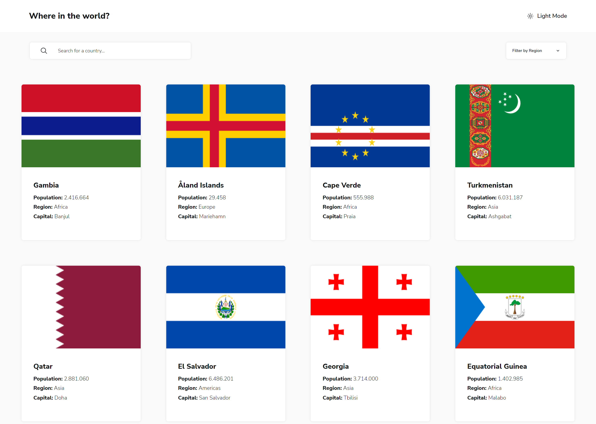
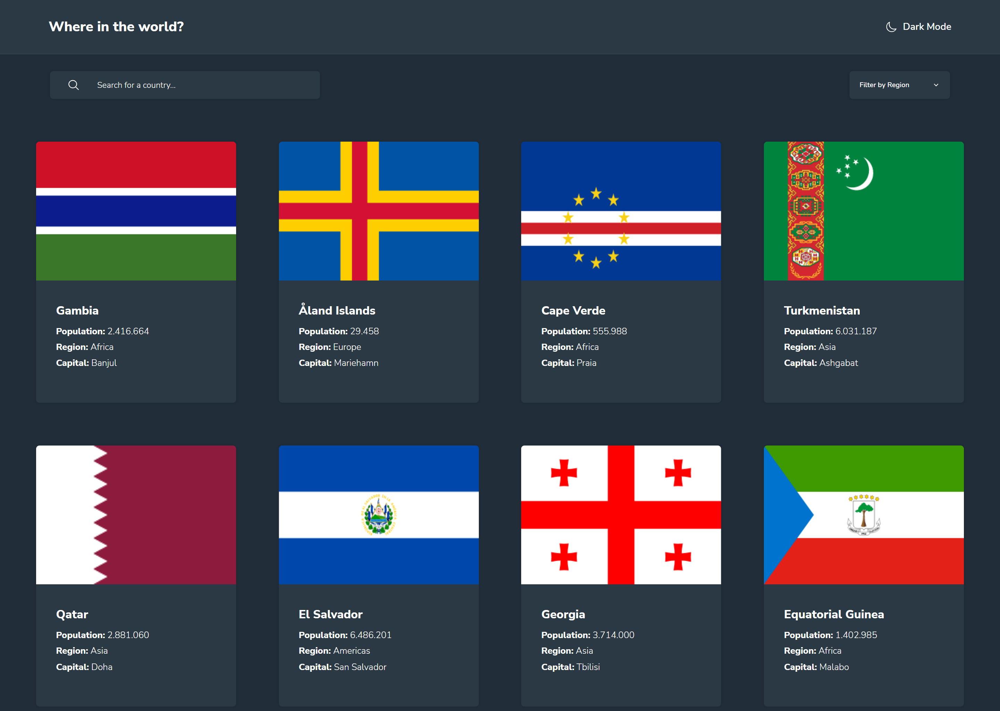
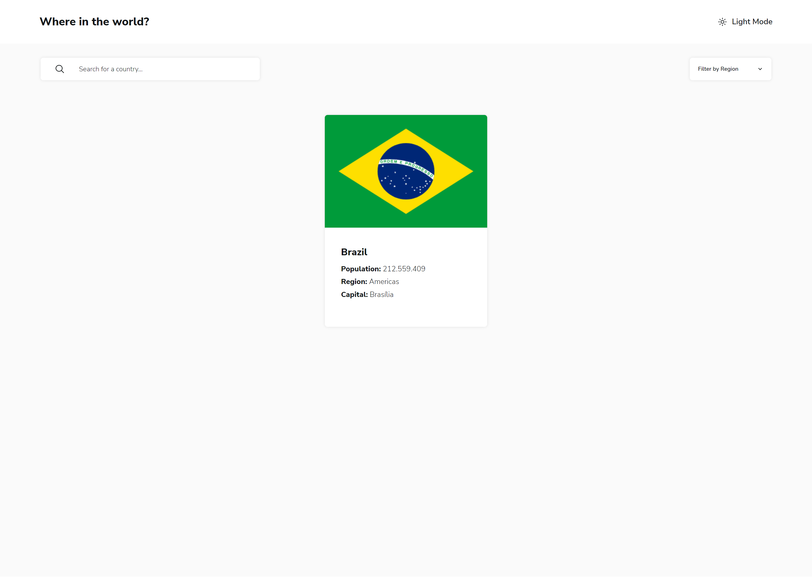
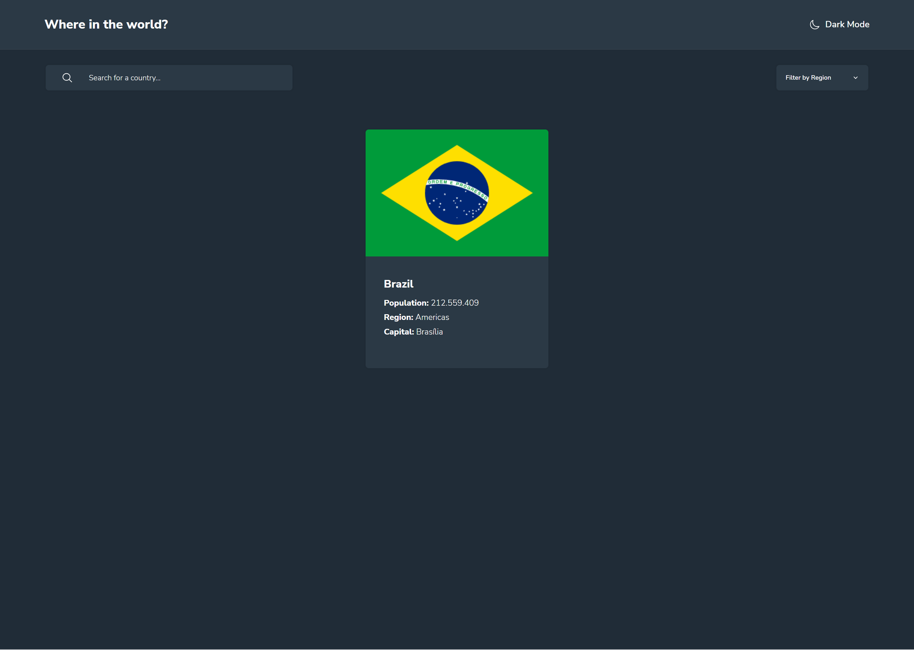
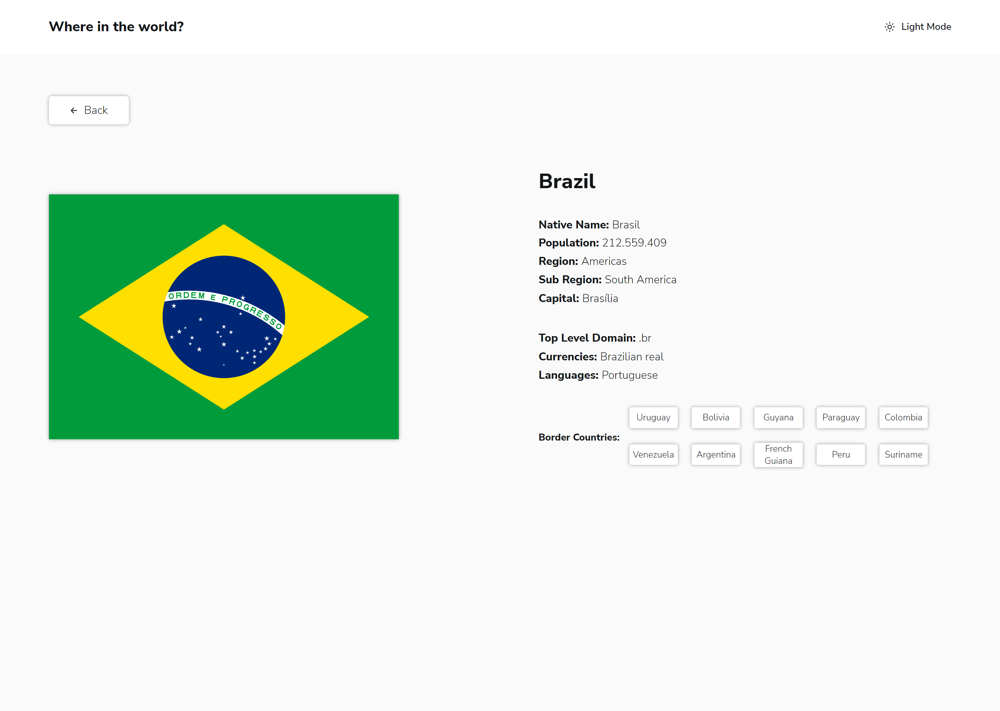
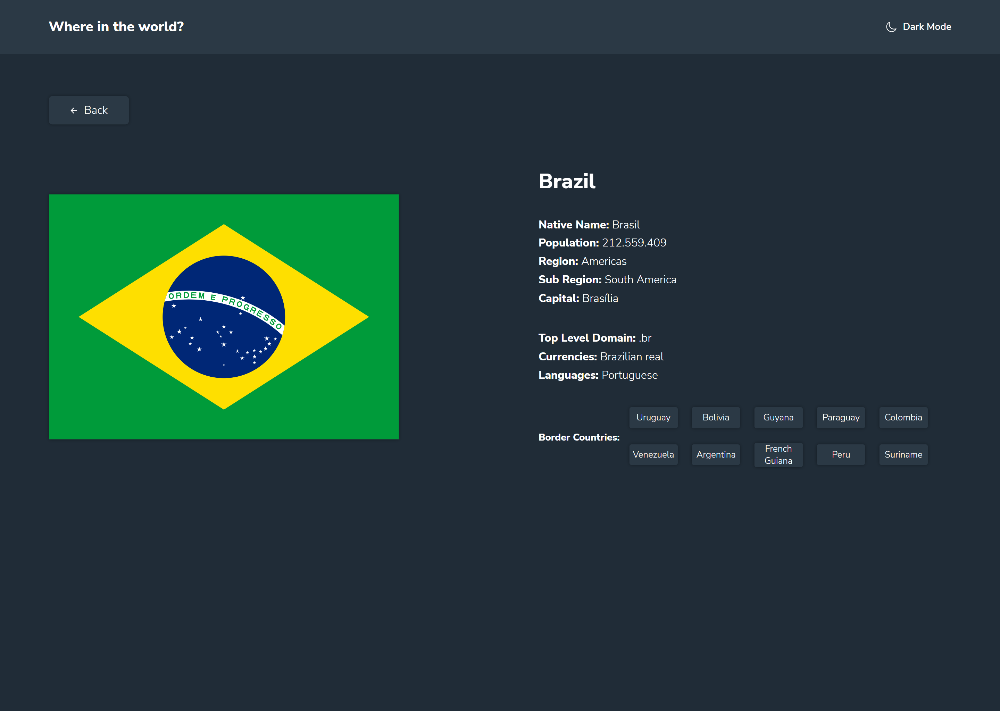

# Frontend Mentor - REST Countries API with color theme switcher solution

This is a solution to the [REST Countries API with color theme switcher challenge on Frontend Mentor](https://www.frontendmentor.io/challenges/rest-countries-api-with-color-theme-switcher-5cacc469fec04111f7b848ca). Frontend Mentor challenges help you improve your coding skills by building realistic projects.

## Table of contents

- [Overview](#overview)
  - [The challenge](#the-challenge)
  - [Screenshots](#screenshots)
  - [Links](#links)
- [My process](#my-process)
  - [Built with](#built-with)
  - [What I learned](#what-i-learned)
  - [Continued development](#continued-development)
  - [Useful resources](#useful-resources)
- [Author](#author)

## Overview

### The challenge

Users should be able to:

- See all countries from the API on the homepage
- Search for a country using an `input` field
- Filter countries by region
- Click on a country to see more detailed information on a separate page
- Click through to the border countries on the detail page
- Toggle the color scheme between light and dark mode _(optional)_

### Screenshots

  
_Homepage on light and dark mode_

---

  
_Search on light and dark mode_

---

  
_The details page when a country is clicked to see more info about it_

---

### Links

- Solution URL: [https://github.com/Willwf/rest-countries-api](https://github.com/Willwf/rest-countries-api)
- Live Site URL: [https://rest-countries-api-willwf.vercel.app/](https://rest-countries-api-willwf.vercel.app/)

## My process

### Built with

- Semantic HTML5 markup
- Flexbox
- Mobile-first workflow
- [React](https://reactjs.org/) - JS library
- [Styled Components](https://styled-components.com/) - For styles
- [Vite.js](https://vitejs.dev/) - Bundler JS
- [React Router](https://reactrouter.com/) - Component for Client Side Routing
- [React Query](https://react-query-v3.tanstack.com/) - Hooks for fetching, caching and updating asynchronous data in React
- [Mantine](https://mantine.dev/) - React components Library
- [Ionicons](https://ionicons.com) - Open source icons

### What I learned

This was a challenging experience because I was able to use many new techniques that I hadn't used before. I tried to always use something new to solve a problem or to accomplish a task in a different way than I had before. Only to feel challenged and expand my knowledge. Even while doing simple things that I previously took for granted, I sometimes got stuck for hours before discovering that just one line of code would solve the problem. It's always interesting to use new techniques in programming.

### Continued development

I feel the need to learn more things but I'm still not sure of where to go. What I want for my next project is to use Typescript, but the rest is unclear to me. I guess I should just keep going.

### Useful resources

- [ChatGPT](https://openai.com/blog/chatgpt/) - This helped me to discover and use a lot of things that I was not used to. Even when I got some wrong responses or out of date information, I was able to extract something that helped me to finish or advance in a feature. It's an amazing tool for a student when used well.
- [Stack Overflown](https://stackoverflow.com/) - Like always, I could not have got this far without it.

## Author

- Github - [William Firmino](https://github.com/Willwf)
- Frontend Mentor - [@Willwf](https://www.frontendmentor.io/profile/Willwf)
- Twitter - [@Williamwf](https://www.twitter.com/Williamwf)
- LinkedIn - [William Firmino](https://www.linkedin.com/in/williamfirmino/)
